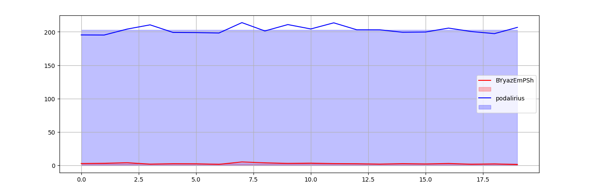
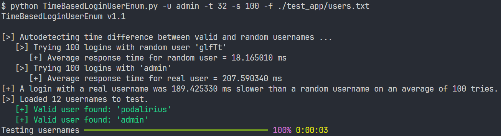

# Time based information leak

This example side channel exploits a time-based information leak vulnerability. The exploit can enumerate if a username is valid by analysing the different response times for a valid versus invalid username. The threat actor would use datasets from data breaches, with the now verified usernames, to perform a more targeted dictionary attack informed by their known previous passwords.

> [!Note]
> Students are not expected to be able to duplicate this application or understand the complex Python implementation. This example is to model how information can leak and then be exploited only.

## Requirements

```bash
pip install requests
pip install matplotlib
pip install rich
```

## Demonstration

### Step 1: Setup

The app needs to be running on port 5000 and the list of usernames to test are in [users.txt](users.txt).

### Step 2: Analysis of time differences between valid and invalid usernames

First step is to analyze whether there is a time based leak of information on the login tries:

```python
python TimeBasedLoginAnalysis.py -u admin -S
```



### Step 3: Enumerate usernames based on response times**

Now that we know that there is a time based leak of information, we can enumerate users with this command:

```python
python TimeBasedLoginUserEnum.py -u admin -t 32 -s 100 -f users.txt
```



## Documentation on the enumeration tool

### Features

**Requirement**: A valid username on the application (no need for password)

- [TimeBasedLoginAnalysis.py](TimeBasedLoginAnalysis.py)

  - Analysis of the response time differences between a valid and invalid username.
  - Plot analysis results to a graph (option `-S` of ) or export to file (option `-f <graph.png>`).
  - Multithreaded login tries.

- [TimeBasedLoginUserEnum.py](TimeBasedLoginUserEnum.py)

  - Extract only usernames returning responses times that stands out.
  - Multithreaded login tries.
  
### Usage

```python
python TimeBasedLoginUserEnum.py -h
usage: TimeBasedLoginUserEnum.py [-h] -u USERNAME -f USERNAMES_FILE [-t THREADS] [-s SAMPLES] [-v]

Enumerate valid usernames based on the requests response times.

optional arguments:
  -h, --help            show this help message and exit
  -u USERNAME, --username USERNAME
                        Username
  -f USERNAMES_FILE, --usernames-file USERNAMES_FILE
                        List of usernames to test
  -t THREADS, --threads THREADS
                        Number of threads (default: 4)
  -s SAMPLES, --samples SAMPLES
                        Number of login tries (default: 20)
  -v, --verbose         Verbose mode. (default: False)

```
